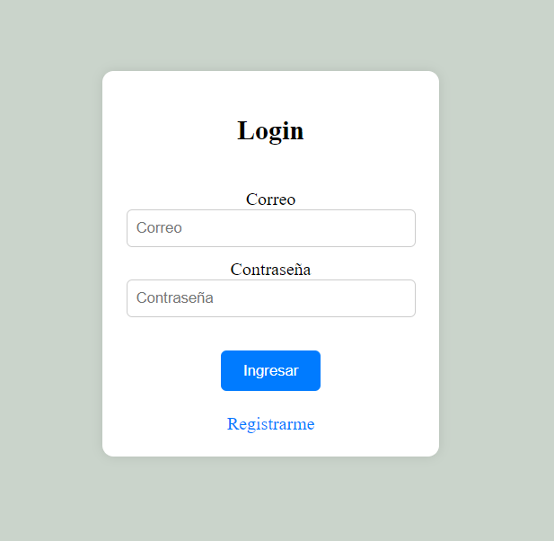
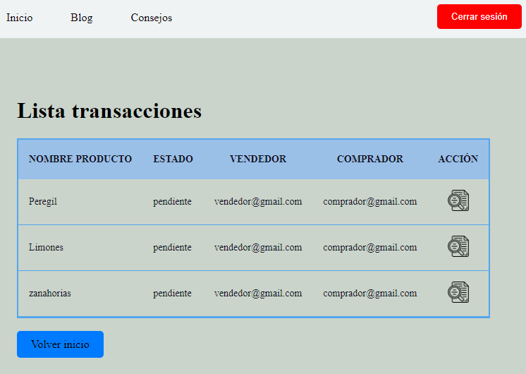
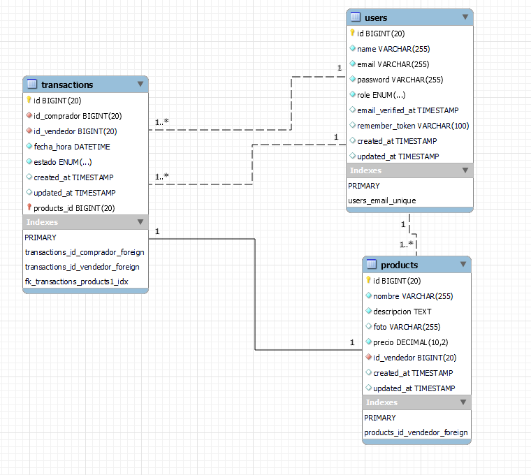

 #  HUERTAONLINE  

**HUERTAONLINE** es una simulación de plataforma de ventas online desarrollada con **Laravel**, diseñada para gestionar productos, usuarios y pedidos de forma sencilla y escalable.  

---

## Características principales  

-  **Autenticación de usuarios** con sistema de login.  
-  **Gestión de productos** desde un panel de administración.  
-  **Tablas dinámicas** para administrar datos con facilidad.  
-  **Eloquent ORM** para manejar la base de datos de manera intuitiva.  
-  **Blade Templates** para vistas dinámicas y reutilizables.  
-  Control de accesos según roles (administrador / usuario).  

---

##  Capturas de pantalla  

###  Login  
  

###  Panel de administración  
  

###  Diagrama de base de datos  
  

---

##  Tecnologías utilizadas  

- **Laravel** → Framework backend en PHP.  
- **Eloquent ORM** → Gestión de base de datos.  
- **Blade** → Sistema de plantillas para las vistas.  
- **MySQL** → Base de datos relacional.  
- **Bootstrap** → Estilos y maquetación responsive.  
- **PHP 8** → Lenguaje de programación principal.  

---

##  Instalación y uso

1. Clona el repositorio:  
   `git clone https://github.com/Guillermo-Munoz/HUERTAONLINE.git`

2. Instala dependencias:  
   `composer install`  
   `npm install && npm run dev`

3. Configura el archivo `.env` con tu base de datos MySQL.

4. Ejecuta las migraciones con datos iniciales:  
   `php artisan migrate --seed`

5. Levanta el servidor de desarrollo:  
   `php artisan serve`

6. Abre en tu navegador:  
   [http://localhost:8000](http://localhost:8000)

---

##  Estado del proyecto

Este proyecto es una **simulación académica** y está en fase de aprendizaje / demostración, no orientado aún a producción.

---

## Proyecto educativo en **Laravel**
